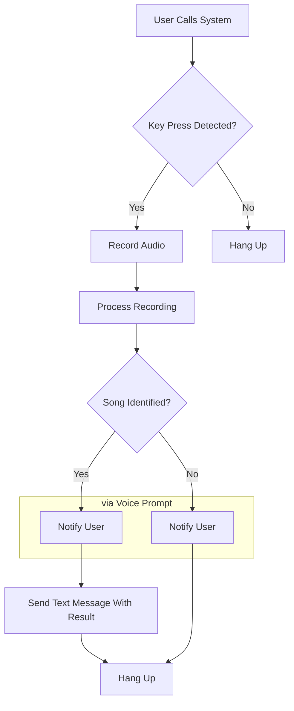

<h1 align='center'>
  SongWut
</h1>

  Shazam, but via Phone-In, for yeshivalite. Wut??
   
  More information: https://songwut.pages.dev

## Versions

### Twilio (`twilio/`)

An API serving as a backend for Twilio webhook calls.

### Asterisk (`asterisk/`)

A custom phone system powered by Asterisk and Docker. See there for step-by-step deployment instructions.  
Involves manually buying a DID from your provider of choice (we chose bulk.vs).

## Flowchart

When a call comes in, the user is routed as follows, as per the dailplan:

## Credits

-   Special thanks to YumiR for his vast knowledge and assistance. It wouldn't have happened without him.
