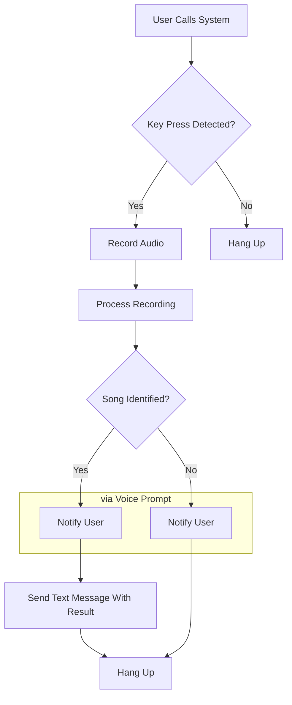

# SongWut

Shazam, but via Phone-In, for yeshivalite. Wut??
More information: https://songwut.pages.dev

## Versions

### Twilio (`twilio/`)

An API serving as a backend for Twilio webhook calls.

### Asterisk (`asterisk/`)

A custom phone system powered by Asterisk (and FreePBX if you want).  
Involves manually buying a DID from your provider of choice (we chose voip.ms), setting up a SIP trunk, and configuring the dialplan.  
We used Vultr to host the Asterisk/FreePBX server.

More complicated, but more control.

## Mermaid Flowchart

For A2P 10DLC applications, the Asterisk dailplan flowchart is as follows:

## Credits

-   Special thanks to YumiR for his vast knowledge and assistance. It wouldn't have happened without him.
