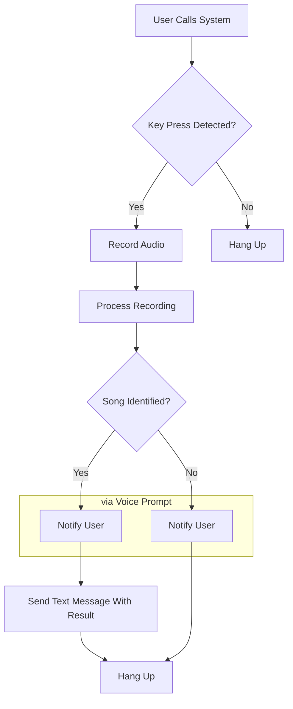

<h1 align='center'>
  📞 SongWut 📞
</h1>

  Shazam, but via Phone-In, for yeshivalite. Wut??
   
  Powered by Asterisk and Docker.
   
  <a href="https://songwut.pages.dev">Website</a>

  

## Setup

### Shazam API

-   Get a free Shazam API key by subscribing to the BASIC tier on this RapidAPI project: https://rapidapi.com/apidojo/api/shazam
-   Keep it handy for the upcoming steps

### SIP Provider

-   [Cheapest] BulkVS - Purchase a DID: [bulkvs.com](https://bulkvs.com)
-   [Premium Quality] VoipMS - Purchase a DID: [voip.ms](https://voip.ms)
    -   Configure the it as a softphone
-   Or any other perferred SIP provider...

### Cloud VPS

-   Deploy a cloud server
    -   Recommended: [Vultr](https://www.vultr.com/?ref=9004439) (referral link)
    -   Minimum specs: 512MB RAM, 1vCPU, 10GB SSD (keep an eye out as the logs can fill up the disk)
    -   OS: Debian 11 or 12 64-bit

## Runnification

-   Install Docker on your server - [Official Guide](https://docs.docker.com/engine/install/debian/)
-   Clone the repo
-   Copy the `.env.example` file to `.env` and populate it with the required values
    -   `SIP_SERVER_HOST` - SIP server hostname (bulkvs: `sip.bulkvs.com`)
    -   `SIP_SERVER_PORT` - SIP server port (usually `5060`)
    -   `SIP_USERNAME` - your SIP username (bulkvs: trunk name, e.g. `123456_trunkname`)
    -   `SIP_PASSWORD` - your SIP password (bulkvs: as created in the "Manage Trunk Group - SIP Registration" dialog)
    -   `SERVER_IP` - your cloud server's public IP address
    -   `YOUR_IP` - your public IP address (for fail2ban whitelisting)
    -   `SERVER_NETWORK_SUBNET` - your cloud server's network address (e.g. `1.2.3.0/24`) (I might've named this variable wrong, I'm not a networking guy)
    -   `SHAZAM_API_KEY` - Your Shazam API key, as obtained above
-   Build the Docker image using compose - `docker-compose build`
-   Run the Docker container headless using compose - `docker-compose up -d`
    -   For testing, omit the `-d` flag to stay attached to the container and see the logs in real-time
-   Note: You'll need to uncomment the sRTP port exposure config in the `docker-compose.yml` file for call audio. It was commented out for performance reasons (see comment in docker-compose) but should be changed. Untested so far. :D

### Testing

-   Test the setup by calling your number!

### Viewing Logs

-   To view the console logs, run `docker-compose logs -f` in the `asterisk` directory
-   All other relevant logs can be seen live in the `docker-volumes` directory (mounted Docker volume)
    -   `asterisk-logs` - Asterisk logs
    -   `songwut-logs` - SongWut detection script execution logs
    -   `songwut-responses` - SongWut detection script Shazam API JSON responses
        -   Pro Tip: Response files that are associated with a successful detection are prepended with the `^` character

### Sending SMS

To send SMS notifications upon successful song detection, you'll need a phone number from an SMS provider that's been approved for A2P 10DLC.  
This is where I got stuck and just decided to open source this project since I wasn't applying as a business and therefore wasn't getting approved.  
Once you've gotten approval, impement the `sendSms` function in the detection script [here](./var/lib/asterisk/agi-bin/songwut/detectAndNotify.js#L151) to send messages. See the example there.  
You can and should use the implementation as provided by your provider for the best results (whether in the form of a node.js package, REST API, or something else).

## Additional Information

See the README.md files in the various folders throughout the repo for more information on the scripts and configurations that lie therein.

### Known Issues

-   SIP connection is not being established and throws an error ([Image](https://i.5e7en.me/ooJAd9w38PO7.png)).
    -   This is happening on my local testing machine and I have yet to try and reproduce to see if it's an actual issue on a cloud server as well.

### Notes

-   We use registration-based authentication for SIP trunking (username & password).
-   We use fail2ban because it can help with attacks against asterisk. Check out the [jail](./etc/fail2ban/jail.local.template) config for our implementation.

### Helpful Commands

-   `sudo su` (required for most Asterisk management stuff)
-   `nano /etc/asterisk/extensions_custom.conf`
-   `asterisk -rx "dialplan reload"`
-   `tail -f /var/log/asterisk/full`
-   `tail -f /var/lib/asterisk/agi-bin/songwut/logs/full.log`
-   Made changes on SIP provider end and lost connection? Re-register -
    -   `asterisk -rx "pjsip send register bulkvs"`
-   Standalone Asterisk:
-   `nano /etc/asterisk/extensions.conf`
-   `asterisk -rx "core restart now"`
-   `asterisk -rvvvvv`
-   `service asterisk status`
-   Docker Exec:
-   `systemctl status asterisk`
-   `systemctl restart asterisk`

## Flowchart

When a call comes in, the user is routed as follows, as per the dailplan:

## Credits

-   Special thanks to YumiR for his vast knowledge and assistance. It wouldn't have happened without him.

## License

This project is licensed under the AGPLv3 License - see the [LICENSE](./LICENSE) file for details.
